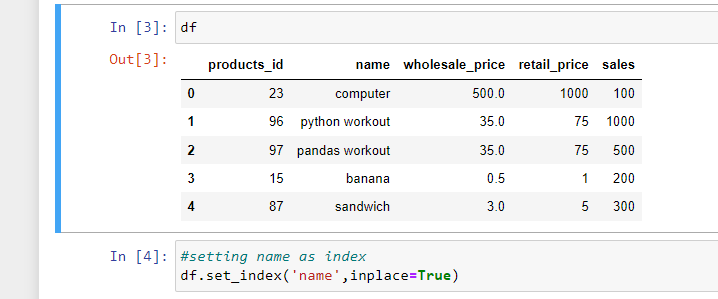
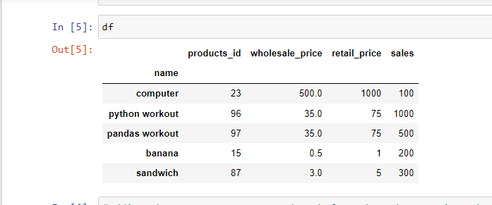
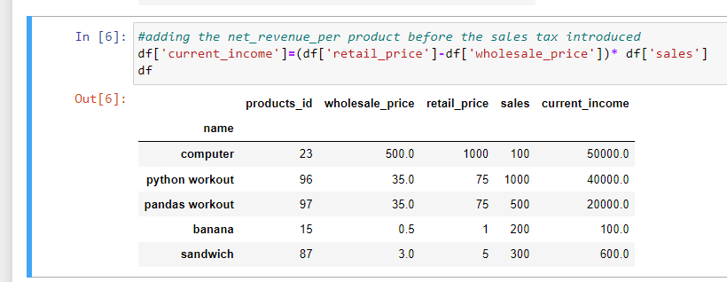
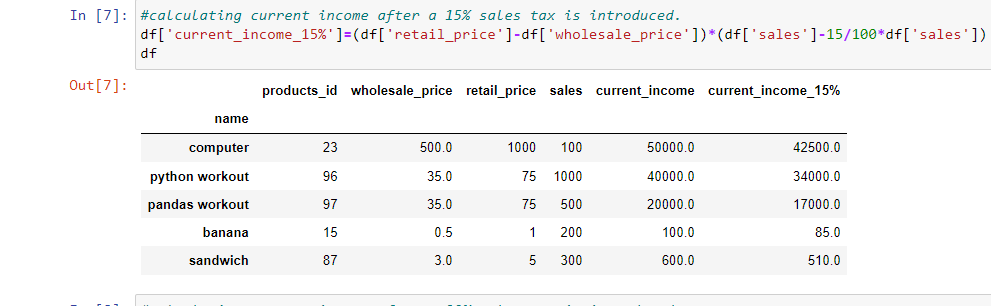
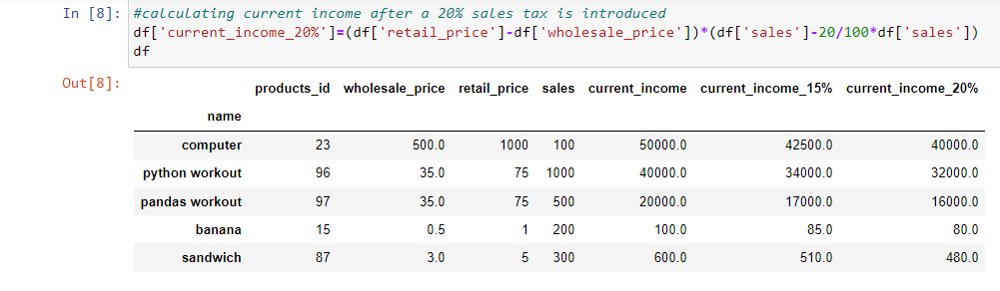
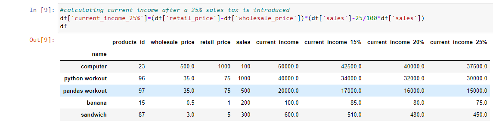

# A-simple-pandas-repository

# Description
This is a simple project on how to create a pandas Data Frame from a dictionary.The created dataframe is used to do simple calculations in pandas.

## Installations
[How to install pandas](https://pandas.pydata.org/docs/getting_started/install.html) 

## Screenshots

## Author
Penina Pendo
